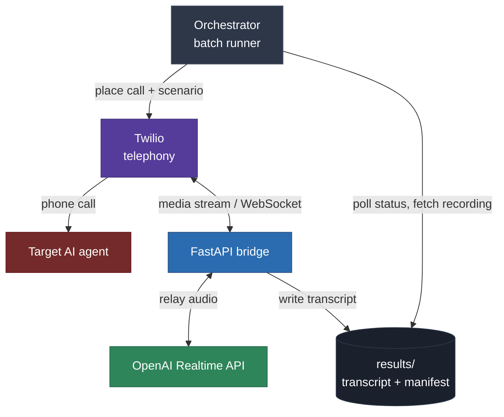

# Patient Simulator Voice Bot

A real-time AI voice agent that places outbound phone calls, holds natural
spoken conversations as a realistic patient, and systematically tests a
third-party AI scheduling agent across 16 distinct scenarios.

Built as a take-home engineering challenge for Pretty Good AI. The bot ran
autonomously, produced 16 call recordings with live transcripts, and surfaced
a structured bug report including a systemic failure that blocked 13 of 16
calls in the target agent.

---

## What it does

The bot dials a real phone number, listens and speaks as a patient persona
defined in a YAML scenario file, and captures a timestamped transcript of
both sides of the conversation as it happens. An orchestrator script runs
the full scenario batch unattended, polling call status between runs and
building a manifest that ties every call to its scenario, recording, and
transcript.

The 16 scenarios were deliberately designed to cross two axes: what the
caller wants (booking, rescheduling, canceling, refills, insurance questions,
edge cases) with what kind of caller they are (brisk, elderly, flustered,
frustrated, vague, interrupting, contradictory). No two calls are alike.

Findings are in [`bug_report.md`](bug_report.md).

---

## Architecture

The system bridges two services with a thin FastAPI server. Twilio handles
the actual phone call and carries audio. OpenAI's Realtime API listens and
speaks as the patient. The bridge relays audio between them in both directions
simultaneously, and writes a live transcript as the call happens.



**The bridge is deliberately thin.** It moves audio and writes transcripts.
It makes no decisions about the conversation. All patient behavior comes from
a per-scenario prompt loaded at call time from `scenarios.yaml`. This keeps
the bridge simple, testable, and easy to reason about.

**Audio passes through without resampling.** Twilio sends G.711 mu-law at
8 kHz. The OpenAI Realtime session is configured to accept and emit the same
codec (`audio/pcmu`), so the bridge forwards raw audio bytes on both legs
with no conversion step. This eliminates a common source of audio artifacts
and reduces code surface area.

---

## Skills demonstrated

### Real-time audio and telephony
- Twilio Media Streams: bidirectional `<Connect><Stream>` over WebSocket,
  custom stream parameters, `start` / `media` / `stop` event handling
- G.711 mu-law codec passthrough on both legs of the bridge
- Outbound call placement, status polling, and recording retrieval via
  the Twilio REST API
- TwiML construction with the Twilio Python helper library

### OpenAI Realtime API
- GA API session configuration (post-beta migration, May 2026)
- `session.update` with nested audio input/output format objects,
  server-side VAD turn detection, per-scenario voice assignment
- Handling both sides of the transcript: `response.output_audio_transcript.done`
  for the bot's own speech and `conversation.item.input_audio_transcription.completed`
  for the agent's speech via a separate `gpt-4o-transcribe` model
- Append-per-line transcript capture so partial transcripts survive
  abrupt call endings

### Async Python
- Two concurrent WebSocket relay tasks (`asyncio.gather`) running
  for the life of each call
- FastAPI WebSocket handler with proper accept-and-read lifecycle
- Async teardown handling: `asyncio.wait` with `FIRST_COMPLETED` so
  either side ending promptly cancels the other

### System design
- Thin bridge pattern: intelligence in the config, not the relay
- Data-driven scenario system: 16 patient personas in YAML, loaded
  per call, keeping scenario logic out of application code
- Flat results layout: one transcript file per call plus a manifest,
  no database needed
- Single hardcoded test number constant so the bot can only ever dial
  the intended target

### AI testing methodology
- 16 scenarios crossed on two axes (task x caller type) to maximize
  coverage and avoid redundant calls
- Live transcript capture enabling post-run analysis without depending
  on audio alone
- Structured bug report with severity tiers, transcript evidence, and
  a clear distinction between the target agent's failures and expected behavior
- Found a systemic identity-verification failure blocking 13 of 16 calls,
  a dead-end fallback handoff, and four additional independent bugs

### Debugging
- Diagnosed TLS interception by antivirus software from raw OpenSSL
  handshake output (5-byte response vs a full Server Hello)
- Migrated session config from the deprecated Realtime API beta structure
  to the GA structure by reading `session.updated` echo events to confirm
  what the API actually accepted
- Resolved async `finally` bypass on WebSocket disconnect by switching
  from end-of-call save to per-line append-as-you-go logging

---

## Stack

| Layer | Technology |
|-------|-----------|
| Telephony | Twilio (outbound calls, media streams, recordings) |
| Voice AI | OpenAI Realtime API (gpt-realtime-2) |
| Bridge server | FastAPI + uvicorn |
| Async runtime | Python 3.12 asyncio |
| Public tunnel | ngrok (stable domain) |
| Scenario config | YAML |
| Call orchestration | Custom Python batch runner |

---

## Repository layout

```
config.py              shared config + the single allowed test number
bridge/
  server.py            FastAPI: TwiML route + media-stream WebSocket
  realtime.py          OpenAI Realtime session, audio relay, transcript capture
orchestrator.py        places calls sequentially, polls status, writes manifest
scenarios.yaml         16 patient personas with voices
results/               transcripts, recordings, manifest.json
bug_report.md          findings from the 16 test calls
architecture.md        full design write-up and decision log
```

---

## Running it

```bash
python3 -m venv .venv && source .venv/bin/activate
pip install -r requirements.txt
cp .env.example .env   # fill in credentials
```

Required environment variables:

```
TWILIO_ACCOUNT_SID=
TWILIO_AUTH_TOKEN=
TWILIO_PHONE_NUMBER=     # E.164 format, e.g. +15625241556
OPENAI_API_KEY=
PUBLIC_BASE_URL=         # your public HTTPS tunnel URL, no trailing slash
```

Three processes, three terminals:

```bash
uvicorn bridge.server:app --port 8000             # bridge server
ngrok http --url=YOUR-DOMAIN.ngrok-free.dev 8000  # public tunnel
python3 orchestrator.py                           # run all 16 scenarios
python3 orchestrator.py book_brisk closed_saturday  # or specific ones
```

---

## What the bot found

Ran 16 diverse scenarios. 13 of 16 converged on the same failure in the
target agent: an identity-verification loop that never resolved, followed
by a fallback handoff that immediately disconnected. The 3 that succeeded
were the 2 that required no verification, and 1 that happened to clear it.

Independent findings included the agent mishearing clearly-spelled names
(Reyes to Rice, 1948 to 1938), breaking character by referencing "demo
purposes," and inconsistent behavior across calls for the same scenario.

Full write-up with transcript evidence and severity ratings:
[`bug_report.md`](bug_report.md)

---

## Notes

Transcripts of the bot's own speech ("BOT") are exact, produced by the
Realtime model itself. The agent side ("AGENT") is transcribed by a separate
`gpt-4o-transcribe` model and may contain minor noise; audio recordings
are authoritative for agent-side quotes. Every call maps to a Twilio
call SID and recording via `results/manifest.json`.